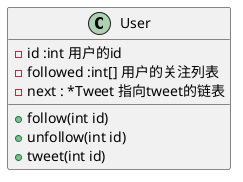
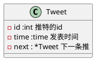

<Watermark />

# 推特模拟器

> 设计一个简化版的推特，可以让用户实现发送推文，关注/取消关注其他用户，能够看见关注人(包括自己的最近10条推文)

<v-click>

````md magic-move
```cpp
class Twitter {}
```
```cpp
Twitter twitter;

twitter.postTweet(1, 5);
// 用户 1 发送了一条新推文 5
twitter.getNewsFeed(1);
// return [5]，因为自己是关注自己的

twitter.follow(1, 2);
// 用户 1 关注了用户 2
twitter.postTweet(2, 6);
// 用户2发送了一个新推文 (id = 6)
twitter.getNewsFeed(1);
// return [6, 5]
// 解释：用户 1 关注了自己和用户 2，所以返回他们的最近推文
// 而且 6 必须在 5 之前，因为 6 是最近发送的

twitter.unfollow(1, 2);
// 用户 1 取消关注了用户 2
twitter.getNewsFeed(1);
// return [5]
```
````
</v-click>

::right::

---
layout: two-cols
---
<Watermark />

<v-click>

## 用户关系

- 用户能关注以及取消关注
- 用户能够看到自己的关注列表

</v-click>


<v-click>



</v-click>

::right::

<v-click>

<CodeTyper :options='{speed:10, text: "class User {\n\
private:\n\
    int id;\n\
    set<int> followed;\n\
    // 用户发表的推文链表头结点\n\
    Tweet* head;\n\
public:\n\
    User(int userId);\n\
    void follow(int userId);\n\
    void unfollow(int userId);\n\
    void post(int tweetId);\n\
}"}' />


</v-click>

---
layout: two-cols
---
<Watermark />

## 用户与推文

<v-click>

- 用户可以发布以及删除推文
- 用户可以查看自己以及关注列表中的推文

</v-click>

<v-click>



</v-click>

::right::

---
---
<Watermark />

<div style="overflow-y: scroll;">

```cpp {monaco} {height:'500px'} 
#include <chrono>
#include <iostream>
#include <queue>
#include <set>
#include <unordered_map>
#include <vector>

using namespace std;

class Twitter;

class Tweet {
public:
  int id;
  int time;
  Tweet *next;
  Tweet(int id, int time) : id(id), time(time) {}

  void setNext(Tweet *n) { this->next = n; }
}; // 保存了发布者的 id 和该推文的发布时间

class User {
private:
  int id;
  set<int> followed;
  Tweet *head;

public:
  friend class Twitter;

  User(int userId) {
    followed = set<int>();
    this->id = userId;
    this->head = NULL;
    follow(id);
  }

  void follow(int userId) { followed.insert(userId); }

  void unfollow(int userId) {
    if (userId != this->id)
      followed.erase(userId);
  }

  set<int> &getfollowed() { return followed; }

  void post(int tweeId) {
    Tweet *twt = new Tweet(
        tweeId, chrono::system_clock::to_time_t(chrono::system_clock::now()));
    twt->setNext(head);
    head = twt;
  }
}; // 保存了他关注的人列表和推文列表

class Twitter {
private:
  static int timestamp;

  unordered_map<int, User> userMap;

public:
  Twitter() { userMap = unordered_map<int, User>(); }
  // user 发表一条 tweet 动态
  void postTweet(int userId, int tweetId) {
    if (userMap.find(userId) == userMap.end()) {
      userMap.insert({userId, User(userId)});
    }
    User &u = userMap.at(userId);
    u.post(tweetId);
  }

  // 返回该 user 关注的人（包括他自己）最近的动态 id，
  // 最多 10 条，而且这些动态必须按从新到旧的时间线顺序排列
  vector<int> getNewsFeed(int userId) {
    vector<int> ans;

    priority_queue<pair<int, Tweet *>> pq;
    set<int> &followed = userMap.at(userId).getfollowed();
    for (int id : followed) {
      Tweet *t = gettwt(&userMap.at(id));
      if (t) {
        pq.push({t->time, t});
      }
    }
    int count = 0;
    while (!pq.empty() && count < 10) {
      Tweet *t = pq.top().second;
      pq.pop();
      ans.push_back(t->id);
      count++;
      if (t->next) {
        pq.push({t->next->time, t->next});
      }
    }

    return ans;
  }

  // follower 关注 followee，如果 Id 不存在则新建
  void follow(int followerId, int followeeId) {
    if (userMap.find(followerId) == userMap.end()) {
      User u(followerId);
      userMap.insert({followerId, u});
    }
    if (userMap.find(followeeId) == userMap.end()) {
      User u(followeeId);
      userMap.insert({followeeId, u});
    }
    userMap.at(followerId).follow(followeeId);
  }

  Tweet *gettwt(User *t) { return t->head; }

  // follower 取关 followee，如果 Id 不存在则什么都不做
  void unfollow(int followerId, int followeeId) {
    if (userMap.find(followerId) != userMap.end()) {
      User &flwer = userMap.at(followerId);
      flwer.unfollow(followeeId);
    }
  }
};

int Twitter::timestamp = 0;

int main() {
  Twitter twitter;          // 创建一个 Twitter 对象
  twitter.postTweet(1, 10); // 用户 a 发布一条 id 为 10 的推文
  vector<int> feed = twitter.getNewsFeed(1); // 用户 a 获取所有推文
  cout << "User a's news feed: ";            // 输出用户 a 的推文
  for (int id : feed) {
    cout << id << " ";
  }
  cout << endl;
  twitter.postTweet(2, 20);      // 用户 b 发布一条 id 为 20 的推文
  twitter.follow(1, 2);          // 用户 a 关注用户 b
  feed = twitter.getNewsFeed(1); // 用户 a 获取推文
  cout << "User a's news feed after following user b: "; // 输出用户 a 的推文
  for (int id : feed) {
    cout << id << " ";
  }
  cout << endl;
  twitter.unfollow(1, 2);        // 用户 a 取消关注用户 b
  feed = twitter.getNewsFeed(1); // 用户 a 获取推文
  cout << "User a's news feed after unfollowing user b: "; // 输出用户 a 的推文
  for (int id : feed) {
    cout << id << " ";
  }
  cout << endl;
  return 0;
}
```
</div>

---
---
<Watermark />
## 效果

<v-click>
    <XVideo :src='"/record/twitter.mp4"' />
</v-click>
