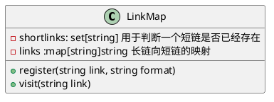
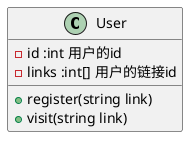

<Watermark />

# 短链系统设计

- 功能性需求
  - 指定一个url能够生成一个短链接
  - 当用户点击短链接的时候会跳转到原始链接
  - 用户可以定义短链接格式
  - 用户可以设置链接的过期时间
- 非功能性需求
  - 系统必须保证高可用，否则如果服务挂了，所有的链接跳转将会失败
  - 链接跳转延迟须尽可能低
  - 短链接内容不能被预测到

::right::

<v-click>

- 多个用户是否可以发布同一个长链接，可以，因为用户可以有自己不同的短链格式，支持多次短链生成
- 用户是否可以访问其他人的链接，可以，目前这个短链生成器是所有用户通用

</v-click>

<v-click>

```cpp
ShortLink sl

sl.newlink(string url, string format, time duration) // 获取短链接，生成的短链接不能重复 如果已经映射过直接返回
sl.visit(string url) // 可以使用短链也可以使用长链访问到原始链接
```

</v-click>

---
layout: two-cols
---
<Watermark />

# 短链类

<v-click>



</v-click>


---
layout: two-cols
---
<Watermark />

# 用户类

<v-click>



</v-click>
