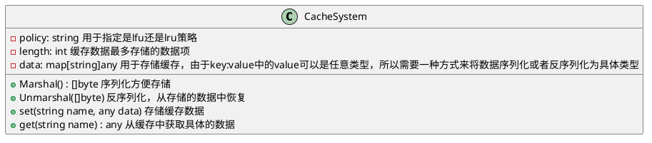
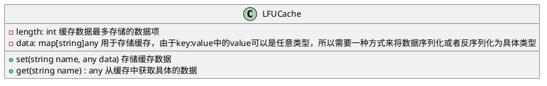

<Watermark />

# 缓存系统

- 支持LRU、LFU多种清理机制
- 提供数据的序列化与反序列化功能

::right::

<v-click>

</v-click>

---
routeAlias: algo-cache
layout: two-cols
---
<Watermark />

# 缓存类

> 由于cachesystem可以实现不同的缓存策略，所以将具体的缓存策略类解耦

::right::

